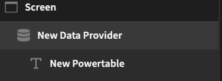
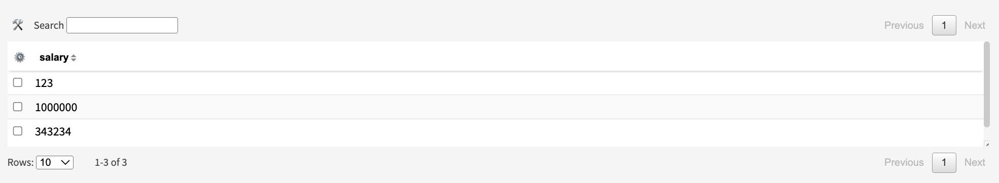

# Powertable

# Description
A conversion of [Muonw's](https://github.com/muonw) fantastic [Powertable](https://github.com/muonw/powertable) component. Allows filtering, wildcard search, custom formatting and more!

This is still in Beta, so please let me know of any bugs.

Find out more about [Budibase](https://github.com/Budibase/budibase).

## Instructions

1. Set up a Data Provider

2. Select either a table or custom query as the source.

3. Add a PowerTable as a child component to the dataprovider.

4. Configure Settings of the Power Table. Settings details can be found here (Powertable)[https://github.com/muonw/powertable]. Not all settings have been brought to this plugin.

# Contributions Appreciated
1. Contributing to the original project
2. Bringing inline editing to Budibase (Most of the front end work has already been done by Muonw)

